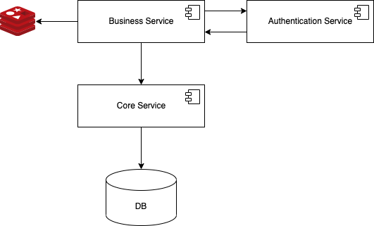

# Tech Design
## Overall Architcture
- A business service to create, retrieve, update and delete data. Except retrieve, all of them need to pass authentication check. But it won't directly access the database. It would accomplish this by sending RPC request to a core service, and stroe the retrieved data into Redis, which is used as cache, to boost the query speed.

- A core service to actually create, retrieve, update and delete data, it will access the database.

- An anthentication service to receive permission check request and return token to the business service.



## Database Schema
For simplicity, we still used sqlite as the database.

User Table
```
CREATE TABLE IF NOT EXISTS user_tab (
    user_id INTEGER NOT NULL PRIMARY KEY,
    user_name string NOT NULL,
    password VARCHAR(256) NOT NULL
);
```

Any Data Table 
(for simplicity, the data table only has a few columns)
```
CREATE TABLE IF NOT EXISTS product_tab (
    id INTEGER NOT NULL PRIMARY KEY,
    product_id INTEGER NOT NULL,
    product_name string NOT NULL,
    shop_id INTEGER NOT NULL,
    price INTEGER NOT NULL,
    stock INTEGER NOT NULL,
    sold INTEGER,
    status INTEGER,
    description TEXT
);
```
## Component 
### Business Service
| API URL | Method |
|:---|:---|
| /api/v1/add_product | POST |

Request Body
```
{
    "product_name": , // compulsory
    "shop_id": , // compulsory
    "price": , // compulsory
    "stock": , // compulsory
    "sold": , // compulsory
    "status": , // compulsory
    "description": 
}
```

Response Body
```
{
    "error": {
        "error_code": ,
        "error_msg": 
    }
}
```
---
| API URL | Method |
|:---|:---|
| /api/v1/get_products | GET |

Query String Parameters 
| Parameter | Type | Default Value |
| :---: | :---: | :---: |
| offset | int | 0 |
| limit | int | 10 |

Response Body
```
{
    "products": [
        {
            "product_id": , 
            "product_name": , 
            "shop_id": , 
            "price": , 
            "stock": , 
            "sold": , 
            "status": , 
            "description": 
        },
    ],
    "error": {
        "error_code": ,
        "error_msg": 
    }
}
```
---
| API URL | Method |
|:---|:---|
| /api/v1/edit_product | POST |

Request Body
```
{
    "product_id": , // compulsory
    "product_name": , // compulsory
    "shop_id": , // compulsory
    "price": , // compulsory
    "stock": , // compulsory
    "sold": , // compulsory
    "status": , // compulsory
    "description": 
}
```
Response Body
```
{
    "error": {
        "error_code": ,
        "error_msg": 
    }
}
```
---
| API URL | Method |
|:---|:---|
| /api/v1/delete_product | DELETE |

Request Body
```
{
    "product_id": , //compulsory
}
```
Response Body
```
{
    "error": {
        "error_code": ,
        "error_msg": 
    }
}
```