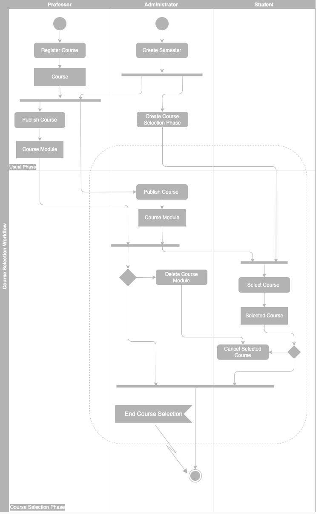
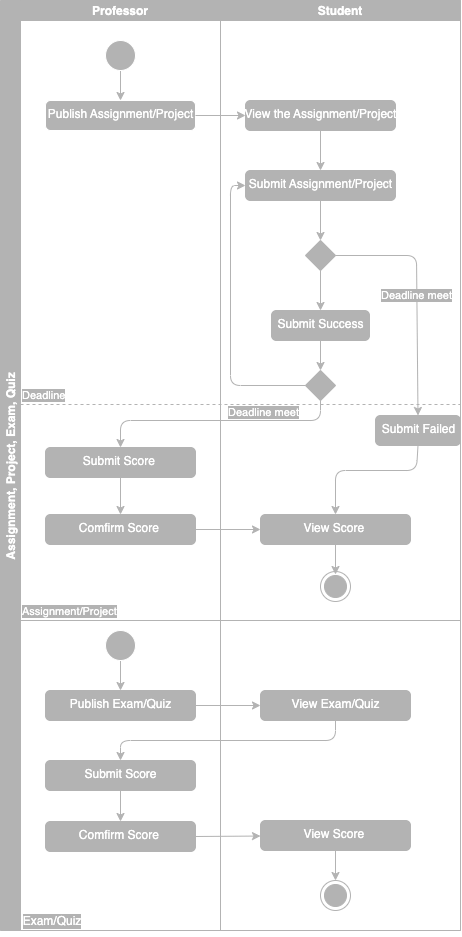

# Requirement Confirmation
What project is going to implement is not clear in the *Aims* section in the main README.md file. So this project is the to help to comfirm all the project function details so that you can take this document as your standard for coding and testing. Actually if you got an project assignment from you actual professor during your real course learning in university, you also need to make every requirement clear before coding or technical design. If no detailed requirement document is provided, you need to write one for yourself. 

At the same time, it needs to be emphasized that this is not a commercial project, so some requirements will not overemphasize the completeness of the functions. Also this is a **REQUIREMENT** document, which means that this article will not consider the code implementation in detail, but will only describe the system based on functional requirements.

# Requirement Details
## System Overall
This Academic Affairs System is mainly used for course selection & cancelation, notification publication & viewing, assignment publication & submitting and score calculation. These functions are designed to work at different time phase. Also, besides the role related functions, the system itself also need to support some basic function workflow.
### Phase Definition of The System
- **Course Selection Phase**
In this phase, students can select and cancel thier selection of courses. <u>But students couldn't select the courses that they have already taken in the last course selection phase.</u> <u>Also professors couldn't publish any course or change the published course info in this phase but still can register a new course. </u>Only administartor can help a professor to publish a registered course or change the course info. And only administartor can configure the phase duration or force an end to this phase. 
- **Usual Phase**
Except Course Selection Phase, all the rest is usual phase. In this phase, professor can register a new course but <u>as long as he/she doesn't publish it, students can't see this course.</u> One he/she publishes this newly registered course, students can see and select it in the next Course Selection Phase.

### Score Calculation
The system should also support the score calculation. Professor needs to set the proportions of different scores when publishing a course and the system would calculate the course final score of a student once the professor sumbits all the scores. After all the scores of one course are submitted, the system should support calculation of score statistics, which are <u>**average score, median score, highest score, lowest score, score distribution**</u>.

### Course Status Change
At particular time, the system can change the course status automatically:
- If a course is newly published, the status is **Reviewing**.
- If the course selection is in progress, convert all the ongoing courses to **Selection In Progress**.
- After the deadline of course selection, convert all the courses which meets the conditions for starting the course to **Normal Teaching**, those don't to **Canceled**
- After professor confirms the end of this course, convert correspoding course status to **Course Ended**.
## Object Definition
### Course & Course Module
A basic course contains such info:
**Course ID, Course Name, College, Credit, Brief**.

If a Course is just registered without publication, it is not visible to students. Professor needs to publish a Course Module based on a Course so that students can see it in the system and select it. Every semester, professors need to publish new Course Modules based on the same Course to refresh Course information. So Course Module is the specific course object and contains the details: **Course Module ID, Professor, Teach Assistant, Semester, Classroom Location, Class Period, Duration, Course Capacity and Score Composition Ratio**. The following chart shows the specific explanation of these infos.
| Field | Explanation |
|:----:|:----|
| Course ID | Unique identifier for a course. It should be generated by system. |
| Course Name | The name of this course. |
| College ID | The college's ID which is offering this course. |
| College Name | The college offering this course. |
| Credit | The credit of this course. |
| Brief | The brief of this course. |
| Course Module ID | Unique identifier for a course module. It should be generated by system. |
| Professor ID | The professor's ID who is teaching this course. |
| Professor  | The professor teaching this course. |
| Teach Assistant ID | The TA's ID of this course project |
| Semester | The semester of this course module. |
| Classroom Location | The location of the classroom. |
| Class Period | The class time period. format: hh:mm - hh:mm. |
| Duration | This course lasts X weeks during this semester. X is the duration. |
| Course Capacity | The maximum number of students this course can host. |
| Min Number of Students| Minimum number of students to start a course. |
| Score Composition Ratio | The score composition ratio of this course. format: <u>A%xAssignment+B%xProject+C%xMidterm+D%xFinal</u>. **A**, **B** and **C** can be **0** while **D** must be no less than **30** and <u>A+B+C+D</u> must be equal to **100** |
| Status | The status of this Course Module: **Selection In Progress, Normal Teaching, Course Ended, Canceled, Reviewing.**|
### User & Role
Student, Professor or Administrator, all of them are Users of this system. The detailed field definition of a user is as this chart:
| Field | Explanation |
|:----:|:----|
| User ID | Unique identifier for a user. It should be generated by system. |
| Name | The name of a user. |
| Gender | The gender of this user.|
| Type | The user type. Student, Professor, Administrator. |
| Password | The password of this user. |

For different roles, on the basis of User fields, each will have different fields.

Student:
| Field | Explanation |
| :----: | :---- |
| Student ID | Student ID generated based on specific rules. |
| Student Email | The email address of this student. (By right the email formats between student and professor are different.)|
| College ID | The college ID of this student. |
| College | The college this student belongs to. |
| Grade | The student's grade. Freshman, Sophomore, Junior, Senior. |
| Enrollment Year | The year that this student was enrolled. |

Professor:
| Field | Explanation |
| :----: | :---- |
| Faculty ID | Faculty ID generated based on specific rules. |
| Professor Email | The email address of this professor. |
| College ID | The college ID of this student. |
| College | The college this student belongs to. |

Administrator:
| Field | Explanation |
| :----: | :---- |
| Faculty ID | Faculty ID generated based on specific rules. |
| Administrator Email | The email address of this administrator. |

### Semester
Semester is a time period, starting from a Monday and ending on a Sunday. All the Course Module duration must fall within a Semester. Only the administrator can create or edit a Semester. 

Semester has 2 type: **Semester** and **Short Semester**. Semester must have at least 16 lecture weeks while Short Semester can have 2 to 6 lecture weeks.

### Notification
Notification is the message sent to other users. Only professor and administrator can send messages. Professor can send notificatons to all the students who take the corresponding course in the current semester while administrator can send notifications to student and professor. Once a user received a notification, he/she can read it or delete it.

From the perspective of the user who sent the notification:
| Field | Explanation |
| :----: | :---- |
| Notification ID | Unique identifier for a notification. It should be generated by system. |
| Title | The notification title. |
| Content | The notification content. |
| Receiver Info | The features of the receivers of this notification, which can be receiver ID or type. |
| Send Time | The send time of this notification. |

From the perspective of the user who receive the notification:
| Field | Explanation |
| :----: | :---- |
| Notification ID | Unique identifier for a notification. It should be generated by system. |
| Title | The notification title. |
| Content | The notification content. |
| Sender Info | The features of the sender of this notification, which can be sender ID or name. |
| Send Time | The send time of this notification. |
| Status | The status of this notification. Have Read, Unread, Deleted. |

### Assignment & Project
| Field | Explanation |
| :----: | :---- |
| Assignment ID | Unique identifier for an assignment. It should be generated by system.  |
| Course Module ID | The corresponding course module ID of this assignment. |
| Professor ID | The professor's ID who publishes this assignment. |
| Professor  | The professor who publishes this assignment. |
| Title | The assignment title. |
| Content | The notification content. |
| Publish Time | The time when it is published. |
| Deadline | The assignment deadline. |

### Exam & Quiz
| Field | Explanation |
| :----: | :---- |
| Exam ID | Unique identifier for an exam. It should be generated by system. |
| Course Module ID | The corresponding course module ID of this exam. |
| Professor ID | The professor's ID who publishes this assignment. |
| Professor  | The professor who publishes this assignment. |
| Title | The assignment title. |
| Content | The notification content. |
| Publish Time | The time when it is published. |
| Exam Time | The exam date and time. |
| Exam Room Location | The exam room location. |

### Score
| Field | Explanation |
| :----: | :---- |
| Course Module ID | The corresponding course module ID of this score. |
| Student ID | The student of this score. |
| Type | The score type. Exam, Assignment, Project. |
| Source ID | The assignment ID or exam ID of this score. |
| Status | The status of this score. Waiting, Submitted, Confirmed. |

## Function & Workflow Definition
### Course Selection 

Only when there is available course module and the course selection phase is created by administrator, student can select or cancel selected course. 
Also at **usual phase**, professor can edit the course and course module and administrator can help a student to be enrolled into a course module which still doesn't meet the maximum capacity.

### Assignment, Project, Quiz or Exam

Before the assignment/project deadline, students can submit as many times as they want but the system will only keep the last submit. Professor need to first submit and then confirm score, otherwise students won't be able to see it. Quiz/Exam is similar to assignment/project workflow but the system won't support online quiz/exam, so theoretically professors can submit score immediately after publishing quiz/exam.

### Notification

### Permission
Here also provides a role permission table for different functions.
|  | Administartor | Professor | Student |
| :---- | :----: | :----: | :----: |
| Create Semester | ✅ | ❌ | ❌ |
| Start/End Course Selection Phase | ✅ | ❌ | ❌ |
| Create/Edit Course during Usual Phase | ✅ | ✅ | ❌ |
| Create/Edit Course during Course Selection Phase | ✅ | ✅ | ❌ |
| Publish/Edit/Delete Course Module during Usual Phase | ✅ | ✅ | ❌ |
| Publish/Edit/Delete Course Module during Course Selectionu Phase | ✅ | ❌ | ❌ |
| View Course | ✅ | ✅ | ❌ |
| View All Course Modules | ✅ | ❌ | ❌ |
| View Course Modules Published by Self| ✅ | ✅ | ❌ |
| View Course Modules Selected by Self| ✅ | ❌ | ✅ |
| Select/Cancel Course Module During Course Selection Phase | ✅ | ❌ | ✅ |
| Select/Cancel Course Module During Usual Phase | ✅ | ❌ | ❌ |
| Publish/Edit Assignment/Project/Exam/Quiz for Selves' Ongoing Course Module | ✅ | ✅ | ❌ |
| Publish/Edit Assignment/Project/Exam/Quiz for Others' Ongoing Course Module | ✅ | ❌ | ❌ |
| Send Noti to All Users | ✅ | ❌ | ❌ |
| Send Noti to All Students Who Are Enrolled in An Ongoing Course | ✅ | ✅ | ❌ |
| View Noti | ✅ | ✅ | ✅ |
| Delete Received Noti | ✅ | ✅ | ✅ |
| Submit Assignment/Project Before Deadline for An Ongoing Course Module | ✅ | ❌ | ✅ |
| Submit Assignment/Project After Deadline for An Ongoing Course Module | ✅ | ❌ | ❌ |
| Submit Assignment/Project For An Ended Course Module | ❌ | ❌ | ❌ |
| Submit/Confirm/View Score of A Student of Ongoing Course Module | ✅ | ✅ | ❌ |
| Submit/Confirm Score of A Student of Ended Course Module | ❌ | ❌ | ❌ |
| View Score of A Student of Ended Course Module | ✅ | ✅ | ✅ |
| View Students' Submitted Assignment/Project Before Deadline| ❌ | ❌ | ✅ |
| View Students' Submitted Assignment/Project After Deadline| ✅ | ✅ | ✅ |
| View Total Gained Credit | ✅ | ❌ | ✅ |

## The Generate Rules of All Kinds IDs & Predefined String
### IDs
- Course ID: College name abbreviation + Recommended university year for course enrollment + Sequentially generated 4-digit course ID
  - Example: School of Computer Science, recommended to be taken in the fourth year of university, the 45th course of this college -- CS40045

- College ID: 3-digit numeric ID, generated in order
  - Example: 001 or 002

- Course Module ID: Course ID + 4-digit random alphanumeric code
  - Example: CS40045-X4b0

- User ID: Randomly generated 8 digit int32 ID
  - Example: 66518090

- Student/Teach Assistant ID: ST + Enrollment year + College ID + Sequentially generated 4-digit course ID
  - Example: get enrolled in 2015, college ID: 010, The 126th student enrolled to this college this year -- ST20150100126

- Professor/Faculty ID: FA + Employment year + College/Department ID + Sequentially generated 4-digit course ID
  - Example: get hired in 1998, college/department ID: 032, The 82nd faculty hired to this college/department this year -- FA19980320082

### Predefined Strings
- Semester: Starting academic year/Ending academic year + A + 1 or 2
  - Example: 2019-2020, the 1st semester: **2019/2020A1**; 2019-2020, the 2nd semester: **2019/2020A2**

- Short Semester: Starting academic year/Ending academic year + S + 1 or 2
  - Example: 2019-2020, the 1st short semester: **2019/2020S1**; 2019-2020, the 2nd short semester: **2019/2020S2**

- Room: Building Name - Level - Room number or name
  - Example: Central Hall - 1 - 01

## Other Functional Requirement Details
- Credit Gaining: If a student's final score of a course module is greater or equal to 60, then he/she will gain the credit of this course. (This project does not consider make-up exams and retakes for the time being.)
- If the total students who select the same course module are less than its min number of students , then the corresponding course module won't enroll any students.
- A course module will be ended automatically after its duration. If students check his/her final score before the professor submits and confirms, he/she will get "Unannounced" instead. But student can still view the project/assignment score which is already announced.
- Except for a small number of unreasonable operations, administrators always have the highest permission. But an administrator can't select a course module or create/publish course/course module for himself/herself, he/she can only do such for a professor or a student.