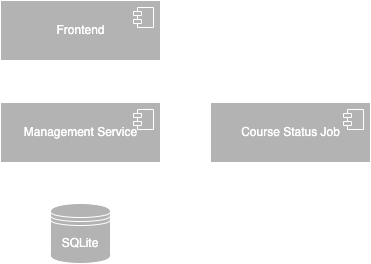
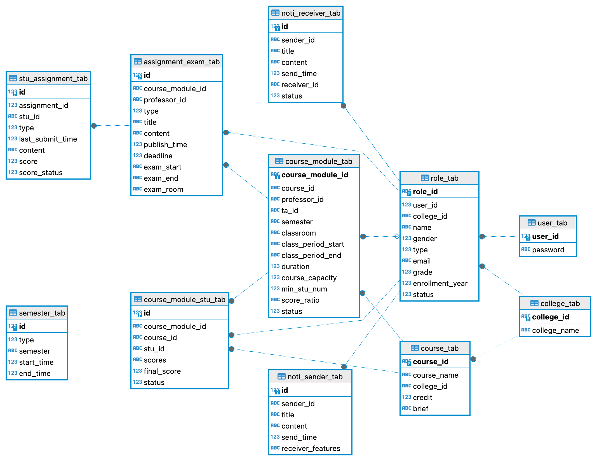

# Tech Design
Tech design document is to solidate as much implementation details as possible. It should cover macro system architecture chart, data structure schema design, database table design, logic flow chart and other UMLs. The most important thing is to help developers sort out their design and implementation ideas before actually writing code. Tech design documents can also serve as a reference when reviewing a project in the future.
# Overall Architecute
Considering the system usage scale, complex desgin won't be introduced into this project. 



The Management Service is main component of this system. Considering the project implementation and debugging difficulty, SQLite as the database is enough. As there is a requirement in the requirement document, to update the course module status automatically, a cron job Course Status Job component is needed.

<mark>**Highlight**: In actual projects, course selection is a very complex process and it is a typical high-concurrency scenario in a short period of time. To solve this, not only the optimization of code logic level, but also the introduction of new middleware components, deployment of service instances and many other aspects will be taken into consideration. However, these contents are not the focus of this project, so the architectural design has been extremely simplified.</mark>

By right, there should be Authentication conponent as the requirement document mentioned different permissions for different roles. But considering the project complexity, this part won't be introduced. I will put it in a separated project instead. <mark>So in this project, all the permission check will be very naive and straightforward.</mark>

# Database Table Design
User Table:
```
CREATE TABLE IF NOT EXISTS user_tab (
    user_id INTEGER NOT NULL PRIMARY KEY,
    password VARCHAR(256) NOT NULL
);
```
College Table:
```
CREATE TABLE IF NOT EXISTS college_tab (
    college_id VARCHAR(256) NOT NULL PRIMARY KEY,
    college_name VARCHAR(256) NOT NULL
);
```
Role Table:
student, professor and administartor have many overlapped fields so that one unified table can be used to store all of them.

status: Normal, Graduated, Suspension, Retired
```
CREATE TABLE IF NOT EXISTS role_tab (
    role_id VARCHAR(256) NOT NULL PRIMARY KEY,
    user_id INTEGER NOT NULL REFERENCES user_tab (user_id),
    college_id VARCHAR(256) NOT NULL REFERENCES college_tab (college_id),
    name VARCHAR(256) NOT NULL,
    gender INTEGER,
    type INTEGER,
    email VARCHAR(256),
    grade INTEGER,
    enrollment_year INTEGER,
    status INTEGER
);
```
Semester Table
```
CREATE TABLE IF NOT EXISTS semester_tab (
    id INTEGER NOT NULL PRIMARY KEY AUTOINCREMENT,
    type INTEGER,
    semester VARCHAR(256) UNIQUE,
    start_time INTEGER,
    end_time INTEGER
);
```
Course Table
```
CREATE TABLE IF NOT EXISTS course_tab (
    course_id VARCHAR(256) NOT NULL PRIMARY KEY,
    course_name VARCHAR(256) NOT NULL,
    college_id VARCHAR(256) NOT NULL REFERENCES college_tab(college_id),
    credit INTEGER,
    brief TEXT
);
```
Course Module Table

The format of score_ratio is "[{"type":1, "ratio":0.1},{"type":1, "ratio":0.1}, {"type":1, "ratio":0.1}, {"type":2, "ratio":0.2}, {"type":3, "ratio":0.2}, {"type":4, "ratio":0.3}]", 1: assignment, 2: quiz or midterm exam, 3: project, 4: final exam.

status: 1: Selection In Progress, 2: Normal Teaching, 3: Course Ended, 4: Canceled, 5: Reviewing.
```
CREATE TABLE IF NOT EXISTS course_module_tab (
    course_module_id TEXT NOT NULL PRIMARY KEY,
    course_id VARCHAR(256) NOT NULL REFERENCES course_tab(course_id),
    professor_id VARCHAR(256) NOT NULL REFERENCES role_tab(role_id),
    ta_id VARCHAR(256) REFERENCES role_tab(role_id),
    semester VARCHAR(256) NOT NULL,
    classroom VARCHAR(256),
    class_period_start VARCHAR(256),
    class_period_end VARCHAR(256),
    duration INTEGER,
    course_capacity INTEGER,
    min_stu_num INTEGER,
    score_ratio TEXT,
    status INTEGER
);
```
Course Module Student Table, to store the course selection data.
status is to mark the selection status, Selecting, Enrolled, Selection Failed, Ended, Failed.

Scores: "[100, 100, 100, 80, 90, 85]"
```
CREATE TABLE IF NOT EXISTS course_module_stu_tab (
    id INTEGER NOT NULL PRIMARY KEY AUTOINCREMENT,
    course_module_id TEXT NOT NULL REFERENCES course_module_tab(course_module_id),
    course_id VARCHAR(256) NOT NULL REFERENCES course_tab(course_id),
    stu_id VARCHAR(256) NOT NULL REFERENCES role_tab(role_id),
    scores TEXT,
    final_score INTEGER,
    status INTEGER
);
```
Assignment/Project/Quiz/Exam Table, the published assignment table.
Type: 1: assignment, 2:quiz, 3: project, 4: final exam. 
```
CREATE TABLE IF NOT EXISTS assignment_exam_tab (
    id INTEGER NOT NULL PRIMARY KEY AUTOINCREMENT,
    course_module_id TEXT NOT NULL REFERENCES course_module_tab(course_module_id),
    professor_id VARCHAR(256) NOT NULL REFERENCES role_tab(role_id),
    type INTEGER NOT NULL, 
    title VARCHAR(256) NOT NULL,
    content TEXT,
    publish_time INTEGER,
    deadline INTEGER,
    exam_start VARCHAR(256),
    exam_end VARCHAR(256),
    exam_room VARCHAR(256)
);
```
Student Assignment/Project/Quiz/Exam Table, the table to store the students' submission of assignmeny/project, this table also stores the students' scores.
score_status: 1: Waiting, 2: Submitted, 3: Confirmed.
```
CREATE TABLE IF NOT EXISTS stu_assignment_tab (
    id INTEGER NOT NULL PRIMARY KEY AUTOINCREMENT,
    assignment_id INTEGER NOT NULL REFERENCES assignment_exam_tab(id),
    stu_id VARCHAR(256) NOT NULL,
    type INTEGER,
    last_submit_time INTEGER,
    content TEXT,
    score INTEGER,
    score_status INTEGER
);
```
Notification Sender Table
receiver_features: a string list, each element represent a feature.
is_all_users, is_all_students, is_all_normal_students, is_all_professors, is_all_normal_professors, course_id, course_module_id, receiver_role_ids

receiver_role_ids is also a list, like ["ST20150100126", "FA19980320082"]
```
CREATE TABLE IF NOT EXISTS noti_sender_tab (
    id INTEGER NOT NULL PRIMARY KEY AUTOINCREMENT,
    sender_id VARCHAR(256) NOT NULL REFERENCES role_tab(role_id),
    title VARCHAR(256),
    content TEXT,
    send_time INTEGER,
    receiver_features TEXT
);
```
Notification Receiver Table status: 1: Unread, 2: Have Read, 3: Deleted
```
CREATE TABLE IF NOT EXISTS noti_sender_tab (
    id INTEGER NOT NULL PRIMARY KEY AUTOINCREMENT,
    sender_id VARCHAR(256) NOT NULL REFERENCES role_tab(role_id),
    title VARCHAR(256),
    content TEXT,
    send_time INTEGER,
    receiver_id VARCHAR(256) NOT NULL REFERENCES role_tab(role_id),
    status INTEGER
);
```
Above all are the database tables used in this project, the overall ER chart is


(Usually, there should be a sequence chart to illustrate the workflow, but this project is quite simple and does not involve interaction between multiple systems, the sqquence chart is not)

# API Design

## Semester Related
| API URL | Method |
|:---|:---|
| /api/v1/create_semester | POST |

To create a new semester, it will check the role permission in the request body. (**Note**: This is not a reasonable approach, but as mentioned earlier, in order to simplify the project complexity. All permission checks after this are the same.)

Request Body
```
{
    "role_id": , // a string, the role id of the semester creator
    "semester": , // a string, format follows the requirement in requirement document
    "start_time": , // an integer timestamp, must be a Monday. But the API won't check it, it should be FE to limit user to select Monday only and convert to a timestamp. It must be later than the end_time of the last semester.
    "end_time": , // an integer, for normal semester, the time duration must be within 16-20 weeks while short semester must be within 2-6 weeks
    "type": // an integer, 1: normal semester, 2: short semester
}
```

Response Body
```
{
    "error_code": // an integer, it would be null if no error 
    "error_message": // a string, it would be null if no error
}
```
---
| API URL | Method |
|:---|:---|
| /api/v1/get_current_semester | GET |

Request
```
{}
```
Response
```
{
    "semester": , 
    "start_time": , 
    "end_time": , 
    "type": ,
    "error_code": // an integer, it would be null if no error 
    "error_message": // a string, it would be null if no error
}
```

## Course Related
| API URL | Method |
|:---|:---|
| /api/v1/create_course | POST |

To create a course. A college couldn't create 2 courses with the same name.

Request
```
{
    "course_name": , // a string
    "college_id": , // a string
    "credit": , // an integer
    "brief": , // a string 
    "creator_role_id": // the creator id, to do permission check
}
```

Response Body
```
{
    "course_id": ,// if the course is successfully created, return the course_id, otherwise return null
    "error_code": ,// an integer, it would be null if no error 
    "error_message": // a string, it would be null if no error
}
```
---
| API URL | Method |
|:---|:---|
| /api/v1/get_course?offset=0&limit=10&college_id=001&course_id=CS40045 | GET |

`offset`, `limit`, `college_id` and `course_id` are path parameters. So this API supports pagination and filtering based on college_id and course_id. *All of them can be empty. If any of them is empty, it would be treated as default value.* 

(The following APIs with path parameters will only list the parameters in the table.)

Path Parameters
| Parameter | Type | Default Value |
| :---: | :---: | :---: |
| offset | int | 0 |
| limit | int | 10 |
| college_id | string | null |
| course_id | string | null |

Response Body
```
{
    "course_list": [
        {
            "course_id": ,
            "course_name": ,
            "college_id": ,
            "credit": ,
            "brief": 
        },
        {
            "course_id": ,
            "course_name": ,
            "college_id": ,
            "credit": ,
            "brief": 
        }
    ]
    "error_code": ,// an integer, it would be null if no error 
    "error_message": // a string, it would be null if no error
}
```
---
| API URL | Method |
|:---|:---|
| /api/v1/edit_course | POST |

To edit a course. 

Request
```
{
    "course_id": , // the course id to be edited, can't be empty
    "course_name": , // a string
    "college_id": , // a string
    "credit": , // an integer
    "brief": , // a string 
    "creator_role_id": // the creator id, to do permission check
}
```
Response Body
```
{
    "error_code": ,// an integer, it would be null if no error 
    "error_message": // a string, it would be null if no error
}
```

# Course Module Related
| API URL | Method |
|:---|:---|
| /api/v1/create_course_module | POST |

To create a course module based on an existing course. 

Request Body
```
{
    "course_id": ,
    "creator_role_id": , // the role id of the creator, can't be empty
    "professor_id": ,// the professor role id of this course module, can't be empty
    "ta_id": ,// the role id of the TA of this course module, can be empty
    "semester": , //can't be empty
    "class_room": ,// string
    "class_period_start": ,// string, the API will check the format
    "class_period_end": ,// string, the API will check the format
    "duration": , //integer, 
    "course_capacity": , //integer, can't be empty
    "min_stu_num": , //integer, can't be empty
    "score_ratio": // string, can't be empty, the API will check the format, like [{"type":1, "ratio":0.1},{"type":1, "ratio":0.1}, {"type":1, "ratio":0.1}, {"type":2, "ratio":0.2}, {"type":3, "ratio":0.2}, {"type":4, "ratio":0.3}]
}
```
Response Body
```
{
    "course_module_id": // if the course module is successfully created, return the course_id, otherwise return null
    "error_code": ,// an integer, it would be null if no error 
    "error_message": // a string, it would be null if no error
}
```
---
| API URL | Method |
|:---|:---|
| /api/v1/get_course_module | GET |

Path Parameter
| Parameter | Type | Default Value |
| :---: | :---: | :---: |
| offset | int | 0 |
| limit | int | 10 |
| college_id | string | null |
| course_id | string | null |
| course_module_id | string | null |
| professor_id | string | null |
| semester | string | {current semester} |
| class_period_start | string | null |
| class_period_end | string | null |

Response Body
```
{
    "course_id": ,
    "course_module_id": ,
    "professor_id": ,// the professor role id of this course module, can't be empty
    "ta_id": ,// the role id of the TA of this course module, can be empty
    "semester": , //can't be empty
    "class_room": ,// string
    "class_period_start": ,// string, the API will check the format
    "class_period_end": ,// string, the API will check the format
    "duration": , //integer, 
    "course_capacity": , //integer, can't be empty
    "min_stu_num": , //integer, can't be empty
    "score_ratio": , // string, can't be empty, the API will check the format, like [{"type":1, "ratio":0.1},{"type":1, "ratio":0.1}, {"type":1, "ratio":0.1}, {"type":2, "ratio":0.2}, {"type":3, "ratio":0.2}, {"type":4, "ratio":0.3}]
    "error_code": ,// an integer, it would be null if no error 
    "error_message": // a string, it would be null if no error
}
```
---
| API URL | Method |
|:---|:---|
| /api/v1/delete_course_module | DELETE |
to delete a course module. 

Request Body
```
{
    "course_module_id": ,// can't be empty; if the id is not existing or imvalid, the API will return error.
    "role_id": // the deleter role id, can't be empty
}
```
Response Body
```
{
    "error_code": ,// an integer, it would be null if no error 
    "error_message": // a string, it would be null if no error
}
```