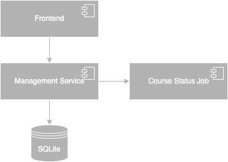

# Tech Design
Tech design document is to solidate as much implementation details as possible. It should cover macro system architecture chart, data structure schema design, database table design, logic flow chart and other UMLs. The most important thing is to help developers sort out their design and implementation ideas before actually writing code. Tech design documents can also serve as a reference when reviewing a project in the future.
# Overall Architecute
Considering the system usage scale, complex desgin won't be introduced into this project. 



The Management Service is main component of this system. Considering the project implementation and debugging difficulty, SQLite as the database is enough. As there is a requirement in the requirement document, to update the course module status automatically, a cron job Course Status Job component is needed.

<mark>**Highlight**: In actual projects, course selection is a very complex process and it is a typical high-concurrency scenario in a short period of time. To solve this, not only the optimization of code logic level, but also the introduction of new middleware components, deployment of service instances and many other aspects will be taken into consideration. However, these contents are not the focus of this project, so the architectural design has been extremely simplified.</mark>

# Database Table Design
User Table:
```
CREATE TABLE IF NOT EXISTS user_tab (
    user_id INTEGER NOT NULL PRIMARY KEY,
    password VARCHAR(256) NOT NULL,
);
```
College Table:
```
CREATE TABLE IF NOT EXISTS college_tab (
    college_id VARCHAR(256) NOT NULL PRIMARY KEY,
    college_name VARCHAR(256) NOT NULL
);
```
Role Table:
student, professor and administartor have many overlapped fields so that one unified table can be used to store all of them.
```
CREATE TABLE IF NOT EXISTS role_tab (
    role_id VARCHAR(256) NOT NULL PRIMARY KEY,
    user_id INTEGER NOT NULL,
    college_id VARCHAR(256) NOT NULL,
    name VARCHAR(256) NOT NULL,
    gender INTEGER,
    type INTEGER,
    email VARCHAR(256),
    grade INTEGER,
    enrollment_year INTEGER,
    FOREIGEN KEY(user_id) REFERENCES user_tab(user_id),
    FOREIGEN KEY(college_id) REFERENCES college_tab(college_id)
);
```
Semester Table
```
CREATE TABLE IF NOT EXISTS semester_tab (
    id INTEGER NOT NULL PRIMARY KEY AUTOINCREMENT,
    type INTEGER,
    semester VARCHAR(256) UNIQUE,
    start_time INTEGER,
    end_time INTEGER
);
```
Course Table
```
CREATE TABLE IF NOT EXISTS course_tab (
    course_id VARCHAR(256) NOT NULL PRIMARY KEY,
    course_name VARCHAR(256) NOT NULL,
    college_id VARCHAR(256) NOT NULL,
    credit INTEGER,
    brief TEXT,
    FOREIGEN KEY(college_id) REFERENCES college_tab(college_id)
);
```
Course Module Table
```
CREATE TABLE IF NOT EXISTS course_module_tab (
    course_module_id TEXT NOT NULL PRIMARY KEY,
    course_id VARCHAR(256) NOT NULL,
    professor_id VARCHAR(256) NOT NULL,
    ta_id VARCHAR(256),
    semester VARCHAR(256) NOT NULL,
    classroom VARCHAR(256),
    class_period_start VARCHAR(256),
    class_period_end VARCHAR(256),
    duration INTEGER,
    course_capacity INTEGER,
    
);
```